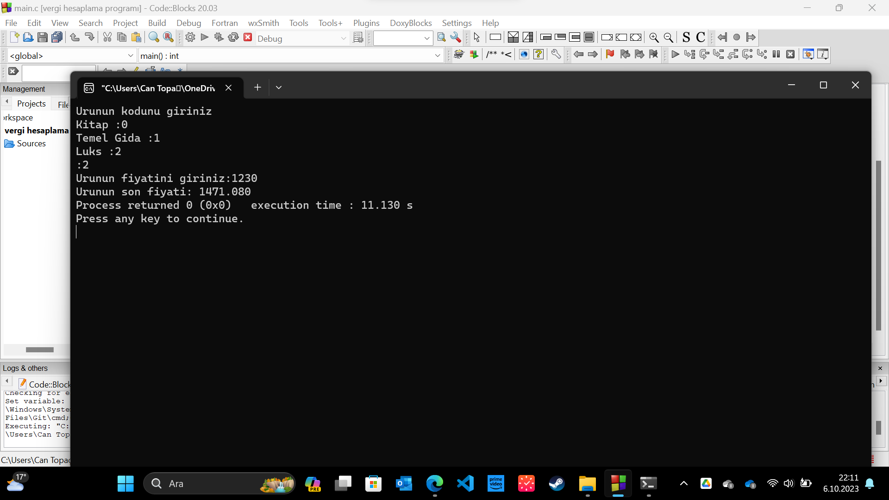

# Ürün Fiyatı Hesaplama Programı



Bu program, kullanıcıdan bir ürünün kodunu ve fiyatını girmesini isteyen basit bir C programıdır. Ardından, girilen koda göre ürünün son fiyatını hesaplar ve kullanıcıya sunar.

## Kullanım

1. Programı derlemek için bir C derleyici kullanmanız gerekmektedir. Örnek olarak, GCC (GNU Compiler Collection) kullanabilirsiniz.
gcc main.c -o urun_fiyat_hesapla


2. Derlendikten sonra, programı çalıştırabilirsiniz.
./urun_fiyat_hesapla

## Örnek Kullanım

1. Programın düzgün çalışabilmesi için, bir C derleyicisinin yüklü ve çalışır durumda olması gerekmektedir.

2. Program, önce ürünün kodunu ve sonra ürünün fiyatını girmenizi isteyecektir.

3. Kullanıcı, ürünün türüne göre aşağıdaki koddan birini girecektir:

Kitap: 0
Temel Gıda: 1
Lüks: 2

4. Program, girilen koda göre ürünün son fiyatını hesaplayacak ve ekranda gösterecektir.

5. Eğer geçerli bir kod girilmezse, program bir hata mesajı gösterecek ve çıkacaktır.

Örnek kullanım:
Urunun kodunu giriniz
Kitap :0 
Temel Gida :1 
Luks :2
:1
Urunun fiyatini giriniz: 100
Urunun son fiyati: 105.600
 


## Program, aşağıdaki başlık dosyalarını kullanmaktadır:

```c
#include <stdio.h>
#include <stdlib.h>
